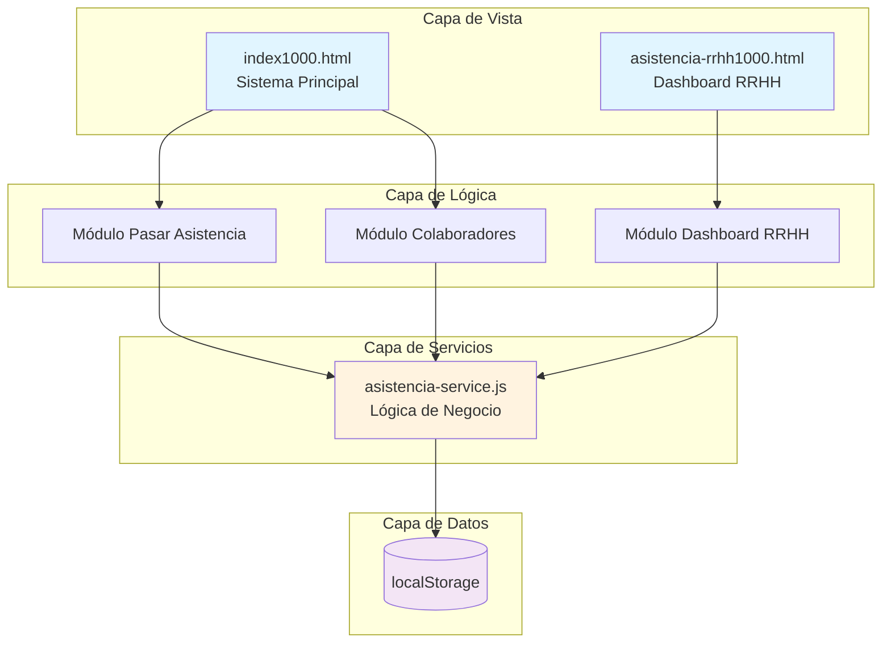
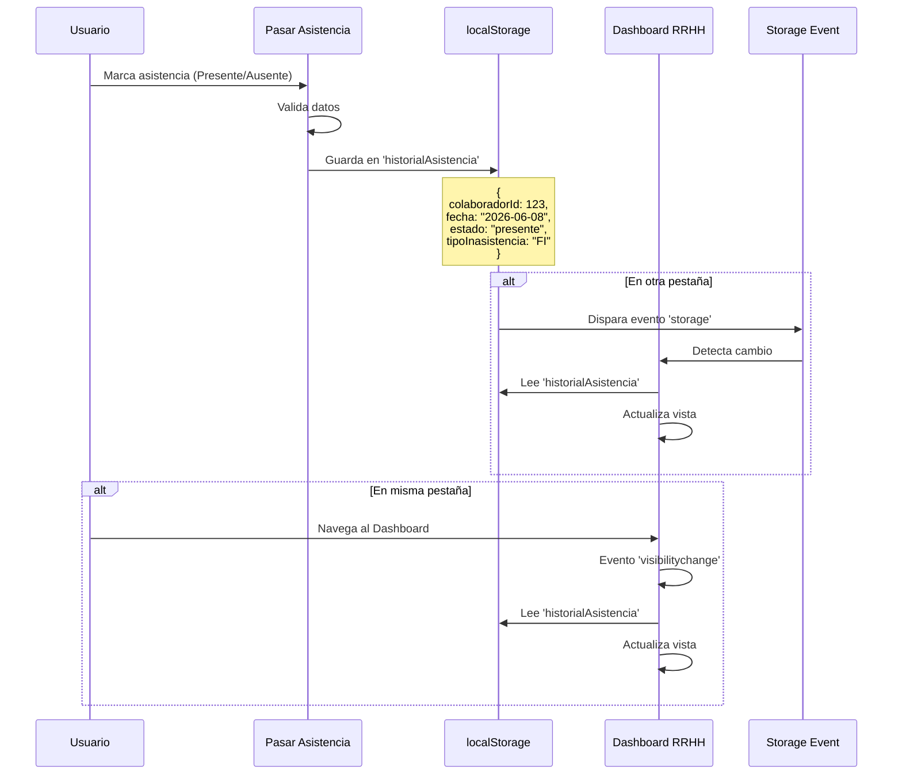
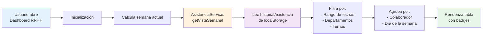
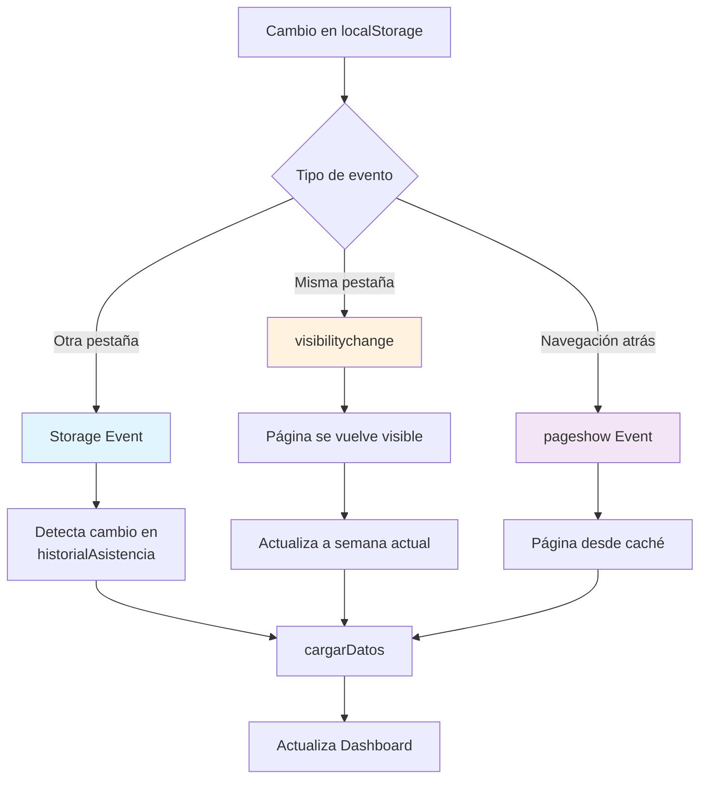

# 📊 Arquitectura del Sistema - MI Technologies Apps Calidad

## 📑 Tabla de Contenidos
1. [Introducción](#introducción)
2. [Arquitectura General](#arquitectura-general)
3. [Flujo de Datos](#flujo-de-datos)
4. [Esquema de Datos (localStorage)](#esquema-de-datos-localstorage)
5. [Módulos Principales](#módulos-principales)
6. [Servicios](#servicios)
7. [Actualización en Tiempo Real](#actualización-en-tiempo-real)

---

## 🎯 Introducción

Sistema de gestión de calidad y asistencia para MI Technologies. La aplicación utiliza **localStorage** como capa de persistencia y está preparada para migración futura a API REST.

### Tecnologías
- **Frontend**: HTML5, CSS3, JavaScript (ES6+)
- **Almacenamiento**: localStorage (preparado para API REST)
- **Arquitectura**: MVC + Service Layer

---

## 🏗️ Arquitectura General



---

## 🔄 Flujo de Datos

### Flujo de Registro de Asistencia



### Flujo de Consulta de Dashboard



---

## 💾 Esquema de Datos (localStorage)

### 1. **colaboradores**
Información de todos los colaboradores del sistema.

```javascript
[
  {
    id: 1,                           // ID único
    nombres: "Juan",
    apellidos: "Pérez García",
    numeroEmpleado: "001234",        // Número de nómina
    departamento: "Producción",
    puesto: "Operador",
    turno: "Turno 1",
    fecha: "2024-01-15",            // Fecha de alta
    estatus: "Activo",              // "Activo" | "Inactivo"
    baja: false,                    // Boolean de baja
    foto: "data:image/jpeg;base64..." // Foto en Base64 (opcional)
  }
]
```

**Usado por:**
- ✅ Módulo Colaboradores
- ✅ Pasar Asistencia
- ✅ Dashboard RRHH

---

### 2. **historialAsistencia**
Registro completo de asistencias e inasistencias.

```javascript
[
  {
    id: 1686234567890,              // Timestamp
    colaboradorId: 1,
    colaboradorNombre: "Juan Pérez García",
    departamento: "Producción",
    fecha: "2026-06-08",            // Formato: YYYY-MM-DD
    hora: "08:30",                  // Hora de registro
    estado: "presente",             // "presente" | "ausente"
    tipoInasistencia: null,         // null si presente
    comentario: null                // Observaciones (opcional)
  },
  {
    id: 1686234567891,
    colaboradorId: 2,
    colaboradorNombre: "María López",
    departamento: "Calidad",
    fecha: "2026-06-08",
    hora: "08:35",
    estado: "ausente",
    tipoInasistencia: "FI",         // Ver tabla de tipos
    comentario: "No avisó"
  }
]
```

**Tipos de Inasistencia:**

| Código | Descripción | Badge Color |
|--------|-------------|-------------|
| `FI` | Falta Injustificada | Amarillo |
| `FJ` | Falta Justificada | Azul claro |
| `PSG` | Permiso Sin Goce | Gris |
| `PCG` | Permiso Con Goce | Gris |
| `IT` | Incapacidad Temporal | Azul |
| `RET` | Retardo | Amarillo |
| `Suspension` | Suspensión | Rojo |
| `CUM` | Cumpleaños | Rosa |
| `FES` | Festivo | Azul |
| `Vacaciones` | Vacaciones | Morado |

**Usado por:**
- ✅ Pasar Asistencia (escribe)
- ✅ Dashboard RRHH (lee)
- ✅ Historial de Asistencia (lee)

---

### 3. **tiemposExtra**
Registro de horas extra trabajadas.

```javascript
[
  {
    id: 1,
    colaboradorId: 1,
    colaboradorNombre: "Juan Pérez García",
    departamento: "Producción",
    fecha: "2026-06-08",
    horasExtra: 2.5,                // Horas trabajadas
    motivo: "Producción urgente",
    aprobado: true                  // Si fue aprobado
  }
]
```

**Usado por:**
- ✅ Dashboard RRHH (Vista Tiempo Extra)
- ✅ Módulo de Tiempo Extra (si existe)

---

### 4. **darkMode**
Preferencia de tema del usuario.

```javascript
"true"  // o "false"
```

**Usado por:**
- ✅ Todos los módulos (tema visual)

---

## 📦 Módulos Principales

### 1. **Pasar Asistencia** (`index1000.html`)

**Ubicación**: `src/pages/index1000.html`

**Responsabilidades:**
- Mostrar lista de colaboradores por departamento
- Marcar asistencia (Presente/Ausente)
- Registrar tipos de inasistencia
- Guardar en `historialAsistencia`

**Flujo:**
```
Usuario selecciona departamento
  → Carga colaboradores activos del departamento
  → Usuario marca asistencia
  → Valida que no exista registro del día
  → Guarda en localStorage
  → Muestra toast de confirmación
```

**Funciones clave:**
- `marcarPresente(colaboradorId, nombres, apellidos, departamento)`
- `abrirModalInasistencia(colaboradorId, ...)`
- `obtenerFechaHoy()` → Retorna formato `YYYY-MM-DD`

---

### 2. **Colaboradores** (`index1000.html`)

**Ubicación**: `src/pages/index1000.html`

**Responsabilidades:**
- Listar colaboradores por departamento
- Buscar colaboradores globalmente
- Mostrar información completa
- Gestionar altas y bajas

**Flujo:**
```
Usuario accede al módulo
  → Carga todos los departamentos
  → Muestra colaboradores activos por departamento
  → Usuario puede buscar globalmente
  → Resultados filtrados en tiempo real
```

---

### 3. **Dashboard RRHH** (`asistencia-rrhh1000.html`)

**Ubicación**: `src/pages/asistencia-rrhh1000.html`

**Script**: `src/assets/js/asistencia-rrhh.js`

**Responsabilidades:**
- Visualizar asistencia en 3 vistas: Semanal, Diaria, Tiempo Extra
- Filtrar por departamento y turno (multiselect)
- Mostrar métricas de asistencia
- Exportar datos a CSV
- Modal con detalle de colaborador

**Flujo de Inicialización:**
```
DOMContentLoaded
  → Calcula semana actual (getNumeroSemana)
  → Carga departamentos y turnos
  → Carga datos (cargarDatos)
  → Configura event listeners
  → Configura actualización en tiempo real
```

**Vistas:**

#### Vista Semanal
- Muestra 7 días (Lunes a Domingo)
- Cada celda muestra badge con estado:
  - ✓ = Presente
  - FI, FJ, PSG, etc. = Tipo de inasistencia
  - \- = Sin registro
- Total de presentes/ausentes por semana

#### Vista Diaria
- Muestra asistencia de un día específico
- Badge completo con descripción: "Falta Injustificada (FI)"
- Filtros de departamento y turno aplican

#### Vista Tiempo Extra
- Lista de registros de horas extra
- Ordenado por fecha
- Muestra total de horas por registro

---

## 🔧 Servicios

### **AsistenciaService** (`asistencia-service.js`)

Capa de servicios que abstrae el acceso a datos. Preparada para migración a API REST.

**Métodos principales:**

#### `getColaboradores()`
```javascript
async getColaboradores()
// Retorna: Array de todos los colaboradores
```

#### `getColaboradoresActivos()`
```javascript
async getColaboradoresActivos()
// Retorna: Array de colaboradores con estatus "Activo"
```

#### `getRegistrosAsistencia(filtros)`
```javascript
async getRegistrosAsistencia({
  departamentos: ['Producción', 'Calidad'],  // Array de departamentos
  turnos: ['Turno 1'],                       // Array de turnos
  fechaInicio: '2026-06-08',                 // YYYY-MM-DD
  fechaFin: '2026-06-14'                     // YYYY-MM-DD
})
// Retorna: Array de registros filtrados
```

#### `getVistaSemanal(semana, año, filtros)`
```javascript
async getVistaSemanal(23, 2026, filtros)
// Retorna: {
//   colaboradores: [
//     {
//       ...datosColaborador,
//       diasSemana: {
//         '2026-06-08': { estado: 'presente', tipoInasistencia: null },
//         '2026-06-09': { estado: 'ausente', tipoInasistencia: 'FI' }
//       },
//       totalPresentes: 5,
//       totalAusentes: 2
//     }
//   ],
//   fechaInicio: '2026-06-08',
//   fechaFin: '2026-06-14',
//   diasSemana: [{fecha, diaSemana, dia}]
// }
```

#### `getRangoSemana(semana, año)`
```javascript
getRangoSemana(23, 2026)
// Retorna: {
//   fechaInicio: '2026-06-08',  // Lunes
//   fechaFin: '2026-06-14'      // Domingo
// }
```

**Cálculo de Semanas:**
- Las semanas empiezan en **Lunes** y terminan en **Domingo**
- Se calcula el primer lunes del año
- Formula: `(7 - diaSemana + 1) % 7`

#### `getNumeroSemana(fecha)`
```javascript
getNumeroSemana(new Date('2026-06-08'))
// Retorna: 23 (número de semana del año)
```

#### `getMetricas(filtros)`
```javascript
async getMetricas(filtros)
// Retorna: {
//   colaboradoresActivos: 150,
//   colaboradoresBaja: 10,
//   totalRegistros: 1200,
//   asistenciaPromedio: 95,
//   inasistencias: 60,
//   presentes: 1140,
//   ausentes: 60,
//   sinRegistrar: 5,
//   deptoConMasFaltas: 'Producción',
//   tiemposExtra: 25
// }
```

---

## 🔄 Actualización en Tiempo Real

### Estrategia de Sincronización

El sistema implementa múltiples estrategias para mantener los datos actualizados:



### Eventos Implementados

#### 1. **Storage Event** (entre pestañas)
```javascript
window.addEventListener('storage', async (e) => {
  if (['colaboradores', 'historialAsistencia', 'tiemposExtra'].includes(e.key)) {
    await cargarDatos();
    showToast('Datos actualizados desde otra pestaña', 'info');
  }
});
```

**Se dispara cuando:**
- Se modifica localStorage desde otra pestaña/ventana
- Usuario pasa asistencia en pestaña A
- Dashboard RRHH en pestaña B se actualiza automáticamente

#### 2. **Visibility Change** (cambio de pestaña)
```javascript
document.addEventListener('visibilitychange', async () => {
  if (!document.hidden) {
    // Actualizar a semana/fecha actual
    dashboardState.semanaActual = asistenciaService.getNumeroSemana(new Date());
    await cargarDatos();
  }
});
```

**Se dispara cuando:**
- Usuario cambia de pestaña y vuelve
- Usuario minimiza ventana y la restaura
- Siempre actualiza a la semana/fecha actual

#### 3. **Page Show** (navegación)
```javascript
window.addEventListener('pageshow', async (event) => {
  if (event.persisted) {
    // Página restaurada desde caché
    await cargarDatos();
  }
});
```

**Se dispara cuando:**
- Usuario usa botón atrás del navegador
- Página se restaura desde bfcache (back-forward cache)

---

## 🎨 Sistema de Badges

### Estados de Asistencia

Los badges visuales ayudan a identificar rápidamente el estado de cada registro:

| Estado | Vista Semanal | Vista Diaria | Clase CSS |
|--------|---------------|--------------|-----------|
| Presente | ✓ (verde) | ✓ Presente | `badge-presente-mini` |
| Falta Injustificada | FI (amarillo) | Falta Injustificada (FI) | `badge-falta` |
| Falta Justificada | FJ (azul claro) | Falta Justificada (FJ) | `badge-falta-justificada` |
| Permiso Sin Goce | PSG (gris) | Permiso Sin Goce (PSG) | `badge-permiso` |
| Permiso Con Goce | PCG (gris) | Permiso Con Goce (PCG) | `badge-permiso` |
| Incapacidad | IT (azul) | Incapacidad Temporal (IT) | `badge-incapacidad-mini` |
| Retardo | RET (amarillo) | Retardo (RET) | `badge-retardo` |
| Suspensión | Suspension (rojo) | Suspensión | `badge-suspension` |
| Cumpleaños | CUM (rosa) | Cumpleaños (CUM) | `badge-cumpleanos` |
| Festivo | FES (azul) | Festivo (FES) | `badge-festivo` |
| Vacaciones | Vacaciones (morado) | Vacaciones | `badge-vacaciones` |
| Sin registro | \- (gris) | \- | `badge-default` |

---

## 📝 Convenciones y Buenas Prácticas

### Formato de Fechas
- **Siempre usar formato ISO**: `YYYY-MM-DD`
- **Función estándar**: `asistenciaService.formatFecha(date)`
- **Ejemplo**: `2026-06-08`

### Estado de Registros
- **Siempre en minúsculas**: `'presente'`, `'ausente'`
- **No usar mayúsculas**: ~~`'Presente'`~~, ~~`'Ausente'`~~

### Keys de localStorage
- `colaboradores` - Lista de colaboradores
- `historialAsistencia` - Registros de asistencia
- `tiemposExtra` - Registros de tiempo extra
- `darkMode` - Preferencia de tema

### Validaciones
- **Registro duplicado**: Verificar que no exista registro del mismo día antes de guardar
- **Colaborador activo**: Solo mostrar colaboradores con `estatus: "Activo"` y `baja: false`
- **Rango de fechas**: Validar que fechaInicio <= fechaFin

---

## 🔮 Preparación para API REST

El sistema está diseñado para migrar fácilmente a una API REST:

### Antes (localStorage)
```javascript
const registros = JSON.parse(localStorage.getItem('historialAsistencia') || '[]');
```

### Después (API REST)
```javascript
const registros = await fetch(this.baseUrl + '/asistencia').then(r => r.json());
```

### Preparación actual
- ✅ Toda la lógica en capa de servicios (`AsistenciaService`)
- ✅ Métodos async/await
- ✅ URL base configurada: `this.baseUrl = '/api'`
- ✅ Comentarios `// TODO:` marcando puntos de migración

---

## 🚀 Próximos Pasos

1. **Implementar API REST**
   - Backend en Node.js + Express o similar
   - Base de datos (MySQL, PostgreSQL)
   - Mantener misma estructura de datos

2. **Optimizaciones**
   - Paginación en vistas grandes
   - Cache de colaboradores
   - Lazy loading de imágenes

3. **Nuevas Funcionalidades**
   - Notificaciones push
   - Reportes PDF
   - Gráficas de tendencias
   - Integración con biométricos

---

## 📞 Soporte

Para dudas sobre la arquitectura, revisar:
- Este documento: `ARQUITECTURA.md`
- Código fuente: Comentarios en cada archivo
- Commits: Historial de cambios en Git

**Última actualización**: Junio 2026
**Versión del sistema**: 1.0.0
