# Diagramas de Arquitectura de Base de Datos - MiSync

## Tabla de Contenidos
1. [Arquitectura Actual (localStorage)](#arquitectura-actual-localstorage)
2. [Arquitectura Propuesta (PostgreSQL)](#arquitectura-propuesta-postgresql)
3. [Diagrama de Migración](#diagrama-de-migración)
4. [Flujo de Datos](#flujo-de-datos)

---

## Arquitectura Actual (localStorage)

### Diagrama Entidad-Relación (Conceptual)

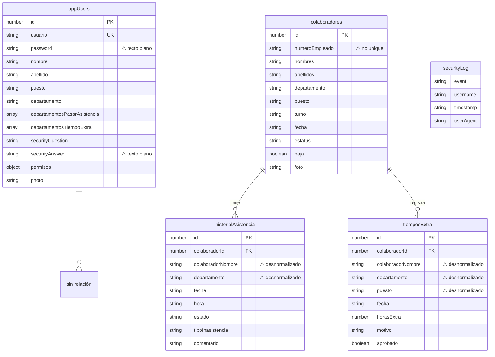

### Diagrama de Almacenamiento

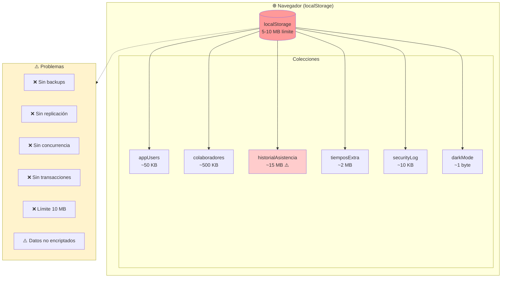

### Flujo de Acceso a Datos (Actual)

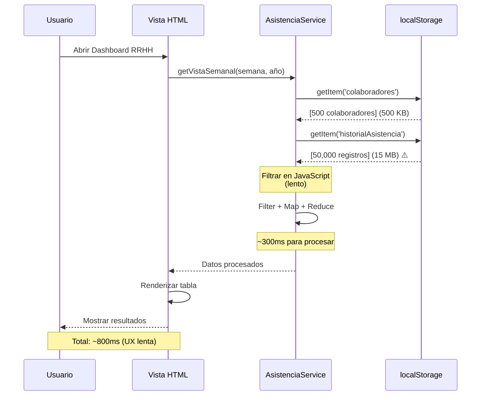

---

## Arquitectura Propuesta (PostgreSQL)

### Diagrama Entidad-Relación (Normalizado)

```mermaid
erDiagram
    usuarios ||--o| usuario_seguridad : "tiene"
    usuarios ||--o{ permisos : "tiene"
    usuarios ||--o{ permisos_departamento : "puede acceder"
    usuarios ||--o{ asistencia : "registra"
    usuarios ||--o{ tiempos_extra : "registra"
    usuarios ||--o{ auditoria : "genera"

    departamentos ||--o{ colaboradores : "contiene"
    departamentos ||--o{ puestos : "tiene"
    departamentos ||--o{ permisos_departamento : "controla"

    puestos ||--o{ colaboradores : "asigna"
    turnos ||--o{ colaboradores : "asigna"

    colaboradores ||--o{ asistencia : "registra"
    colaboradores ||--o{ tiempos_extra : "trabaja"

    tipos_inasistencia ||--o{ asistencia : "clasifica"

    usuarios {
        serial id PK
        varchar username UK "✓ único"
        varchar password_hash "✓ bcrypt"
        varchar nombre
        varchar apellido
        varchar puesto
        varchar email UK
        varchar foto_url
        boolean activo
        timestamptz created_at
        timestamptz updated_at
        integer created_by FK
        integer updated_by FK
    }

    usuario_seguridad {
        integer usuario_id PK_FK
        varchar pregunta_seguridad
        varchar respuesta_hash "✓ bcrypt"
        integer intentos_fallidos
        timestamptz bloqueado_hasta
        timestamptz updated_at
    }

    departamentos {
        serial id PK
        varchar nombre UK
        varchar codigo UK
        boolean activo
        timestamptz created_at
    }

    puestos {
        serial id PK
        varchar nombre UK
        varchar codigo
        integer departamento_id FK
        boolean activo
        timestamptz created_at
    }

    turnos {
        serial id PK
        varchar nombre UK
        time hora_entrada
        time hora_salida
        boolean activo
    }

    permisos {
        integer usuario_id PK_FK
        varchar modulo PK
        boolean puede_ver
        boolean puede_crear
        boolean puede_editar
        boolean puede_eliminar
    }

    permisos_departamento {
        integer usuario_id PK_FK
        integer departamento_id PK_FK
        varchar modulo PK
    }

    colaboradores {
        serial id PK
        varchar numero_empleado UK "✓ único"
        varchar nombres
        varchar apellidos
        integer departamento_id FK
        integer puesto_id FK
        integer turno_id FK
        varchar foto_url
        date fecha_alta
        date fecha_baja
        varchar estatus
        text motivo_baja
        timestamptz created_at
        timestamptz updated_at
        integer created_by FK
        integer updated_by FK
    }

    tipos_inasistencia {
        varchar codigo PK
        varchar descripcion
        boolean justificado
        varchar color
        boolean activo
        integer orden_visualizacion
        timestamptz created_at
    }

    asistencia {
        serial id PK
        integer colaborador_id FK "✓ con índice"
        date fecha "✓ con índice"
        time hora
        varchar estado
        varchar tipo_inasistencia FK
        text comentario
        integer registrado_por FK
        timestamptz created_at
        timestamptz updated_at
    }

    tiempos_extra {
        serial id PK
        integer colaborador_id FK
        date fecha
        decimal horas_extra
        text motivo
        boolean aprobado
        integer aprobado_por FK
        timestamptz fecha_aprobacion
        integer registrado_por FK
        timestamptz created_at
        timestamptz updated_at
    }

    auditoria {
        serial id PK
        varchar tabla
        varchar operacion
        integer registro_id
        integer usuario_id FK
        jsonb datos_anteriores
        jsonb datos_nuevos
        inet ip_address
        text user_agent
        timestamptz created_at
    }

    log_seguridad {
        serial id PK
        varchar evento
        varchar username
        integer usuario_id FK
        boolean exitoso
        inet ip_address
        text user_agent
        jsonb detalles
        timestamptz created_at
    }
```

### Diagrama de Infraestructura Propuesta

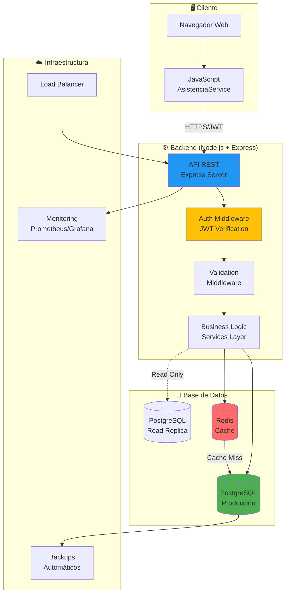

### Flujo de Acceso a Datos (Propuesto)

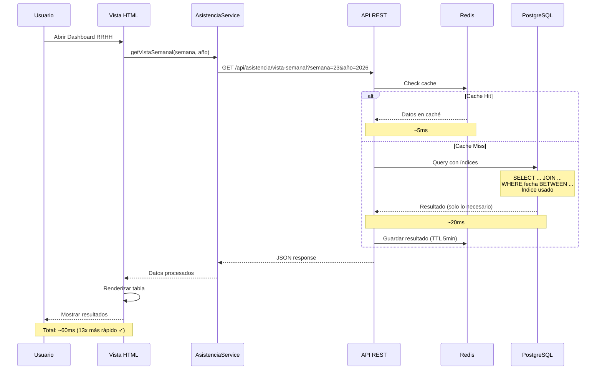

---

## Diagrama de Migración

### Proceso de Migración de Datos

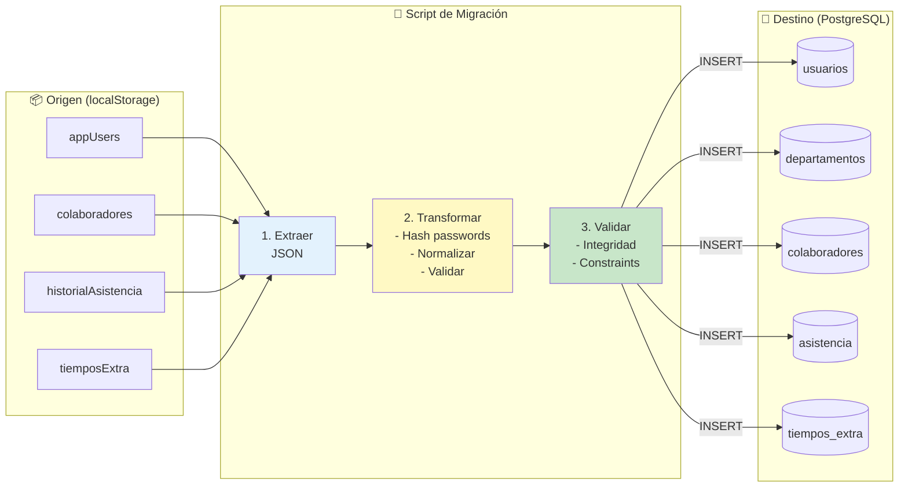

### Estrategia de Migración por Fases

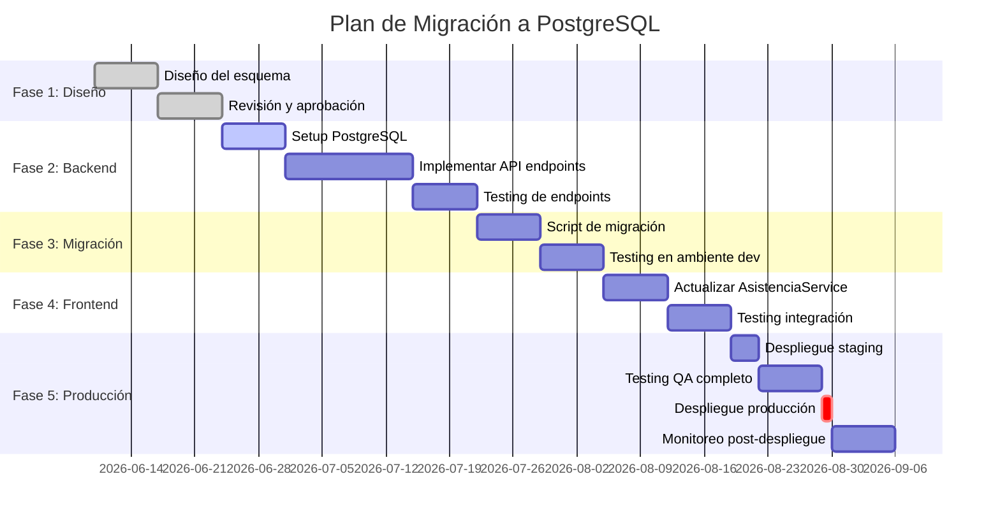

---

## Flujo de Datos

### Flujo de Autenticación (Actual vs Propuesto)

#### Actual (localStorage)

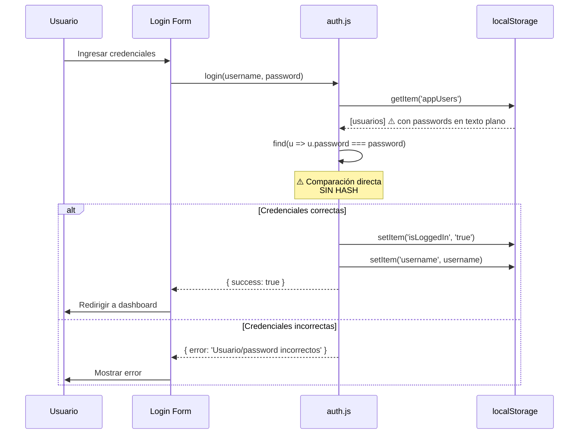

#### Propuesto (PostgreSQL + JWT)

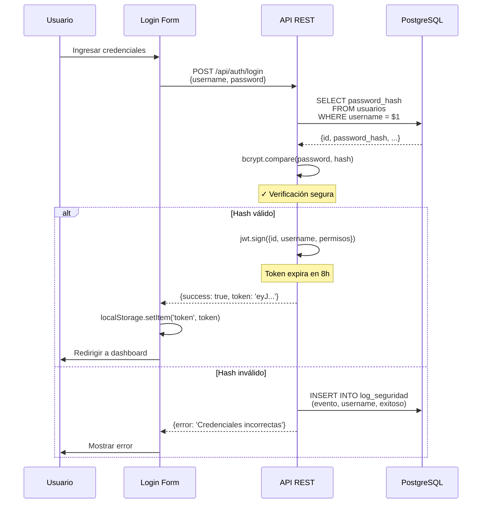

### Flujo de Registro de Asistencia (Comparación)

#### Actual

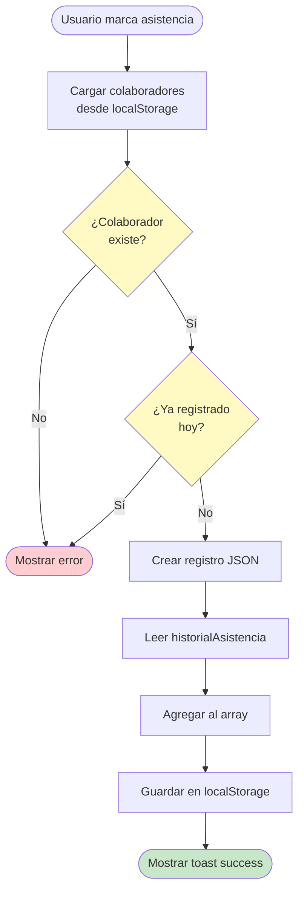

#### Propuesto

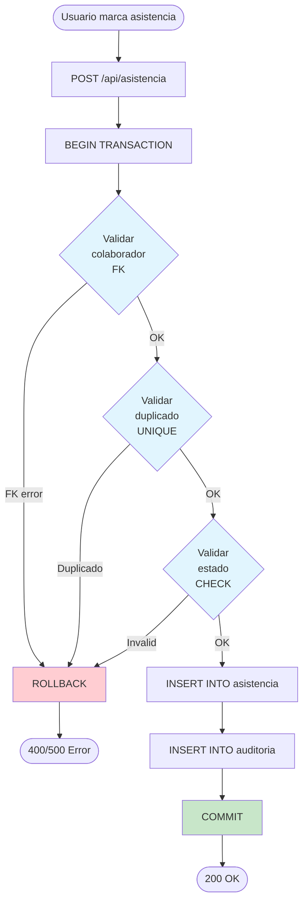

---

## Diagrama de Índices y Performance

### Estrategia de Indexación

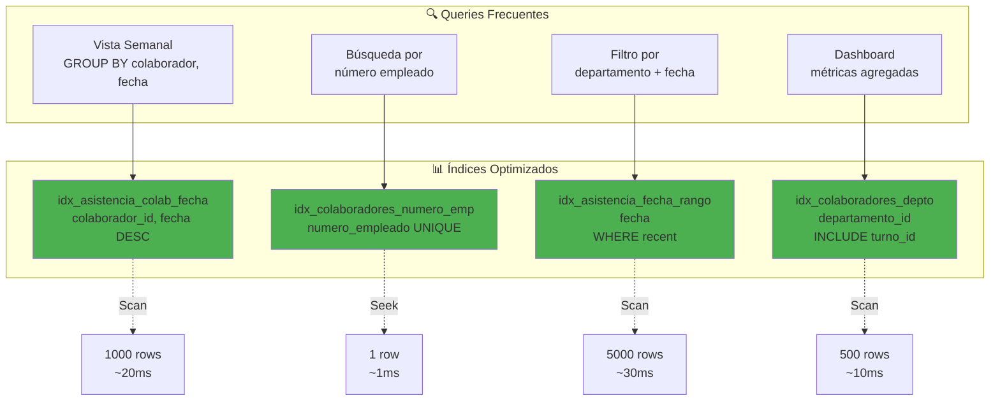

### Comparación de Performance

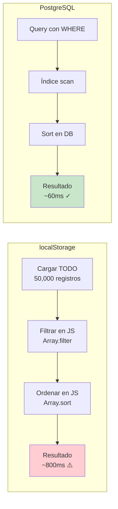

---

## Diagrama de Seguridad

### Comparación de Seguridad: Antes vs Después

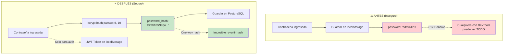

### Flujo de Recuperación de Contraseña Seguro

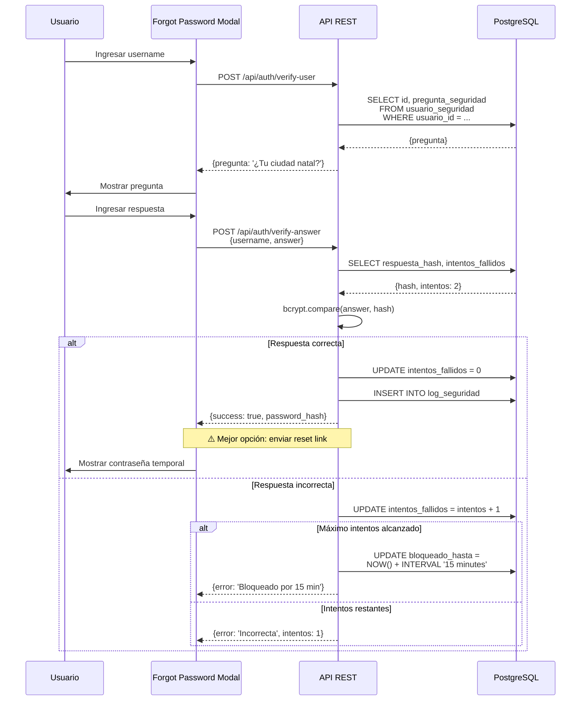

---

## Diagrama de Backup y Recuperación

### Estrategia de Backup Propuesta

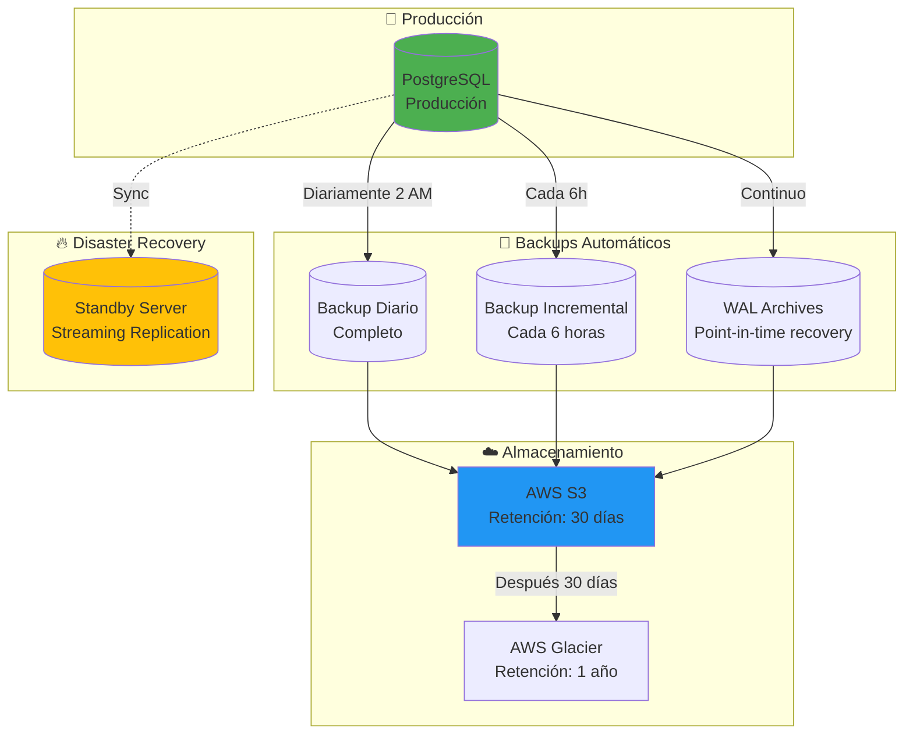

---

**Documento generado:** 2026-06-09
**Herramientas:** Mermaid.js diagrams
**Formato:** Markdown compatible con GitHub/GitLab
